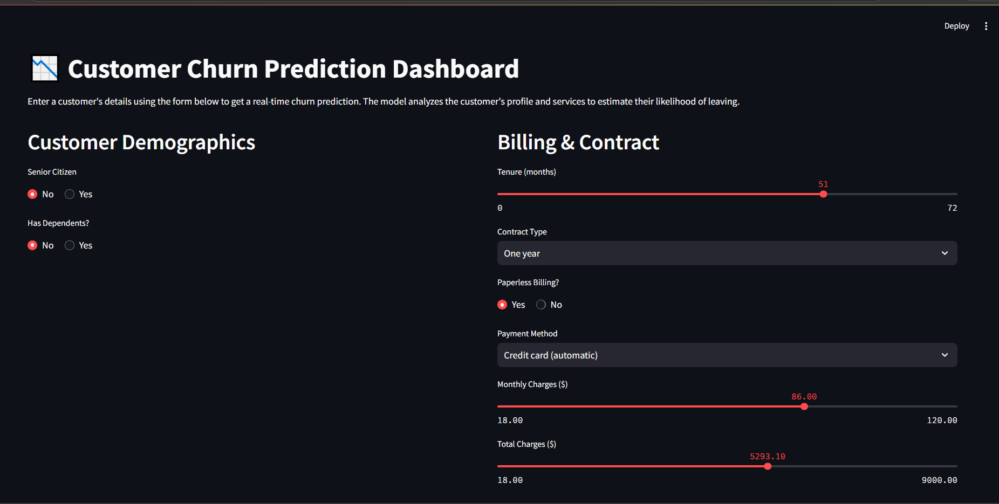
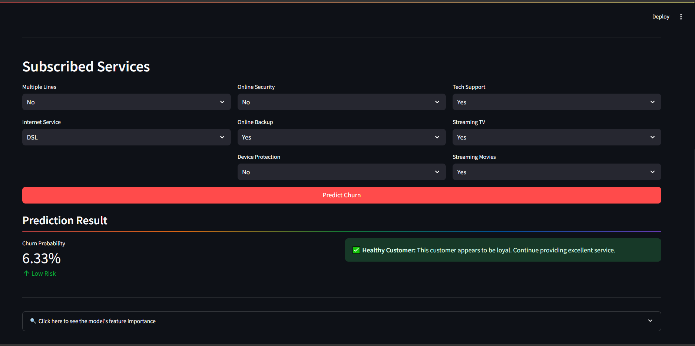
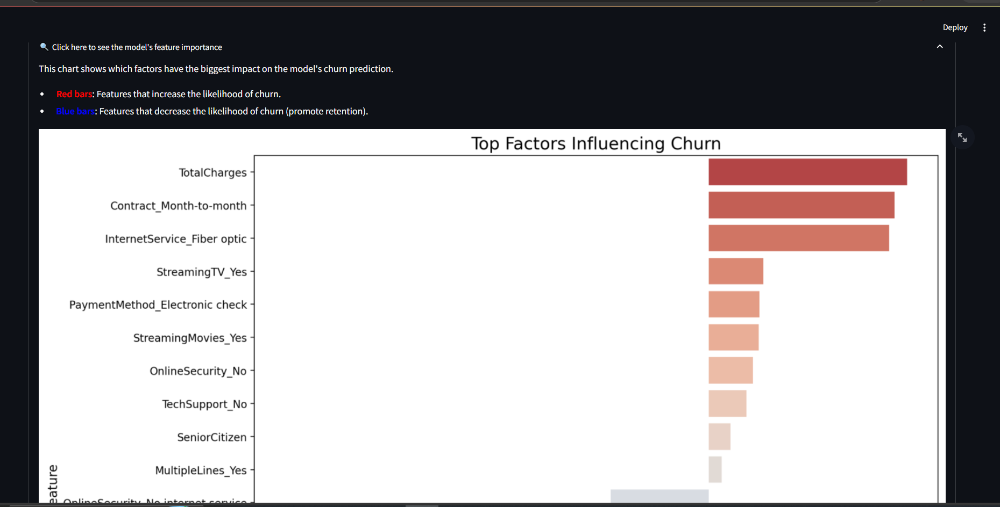
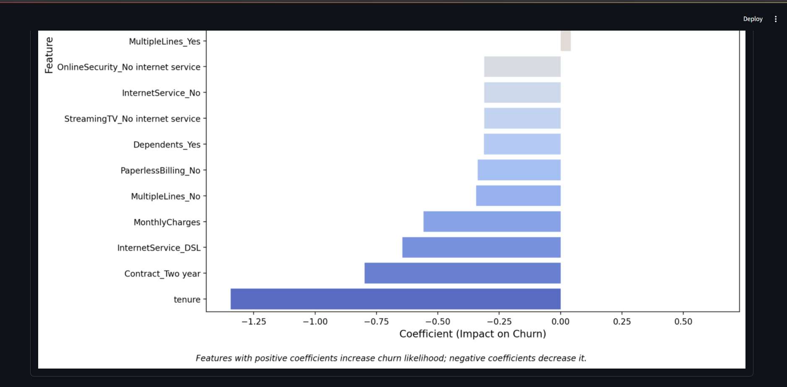

# 📊 Customer Churn Analysis & Prediction System

<div align="center">

### 🚀 Machine Learning Web Application for Customer Retention Analytics

Predict customer churn using Machine Learning and gain actionable business insights through an interactive Streamlit dashboard.

🌐 **Live Demo:**  
https://telco-churn-analysis.streamlit.app/

</div>

---

# 📌 Overview

This project is a Machine Learning-powered Customer Churn Prediction System built to analyze customer behavior and predict whether a customer is likely to leave a service. 
It helps businesses improve customer retention strategies using data-driven insights.

---

# 🎯 Project Objectives

✅ Predict whether a customer is likely to churn  
✅ Analyze customer behavior and retention patterns  
✅ Identify important factors influencing churn  
✅ Provide an interactive and user-friendly prediction interface  
✅ Support data-driven business decision making  

---

# 🧠 Machine Learning Model

| Category | Details |
|----------|----------|
| Model Used | Logistic Regression |
| Problem Type | Binary Classification |
| Framework | Scikit-learn |
| Target Variable | Customer Churn |
| Prediction Output | Churn / No Churn |

---

# 🛠️ Technology Stack

| Technology | Purpose |
|------------|---------|
| Python | Core Programming Language |
| Pandas | Data Cleaning & Analysis |
| NumPy | Numerical Computation |
| Scikit-learn | Machine Learning |
| Matplotlib | Data Visualization |
| Seaborn | Statistical Visualization |
| Streamlit | Web Application Framework |

---

# ✨ Features

- 🔍 Real-time customer churn prediction
- 📊 Interactive data visualizations
- 📈 Customer behavior analysis
- ⚡ Fast and user-friendly Streamlit interface
- 🤖 Machine Learning-powered predictions
- 📉 Business insights for retention strategies

---

# 📂 Project Structure

```bash
customer-churn-analysis/
│
├── screenshots/
│   ├── 01_streamlit_input.png
│   ├── 02_streamlit_prediction.png
│   ├── 03_churn_distribution_1.png
│   └── 04_churn_distribution_2.png
│
├── run.py
├── churn_model.joblib
├── churn_model_training.ipynb
├── requirements.txt
└── README.md
```

---

# 📸 Application Screenshots

## 🧾 Customer Input Interface



---

## 📊 Churn Prediction Result



---

## 📉 Churn Analysis Dashboard



---

## 📈 Customer Insights Visualization



---

# ⚙️ Installation & Setup

## 1️⃣ Clone the Repository

```bash
git clone https://github.com/YOUR_USERNAME/customer-churn-analysis.git
```

---

## 2️⃣ Navigate to Project Directory

```bash
cd customer-churn-analysis
```

---

## 3️⃣ Create Virtual Environment

```bash
python -m venv venv
```

---

## 4️⃣ Activate Virtual Environment

### Windows

```bash
venv\Scripts\activate
```

### macOS / Linux

```bash
source venv/bin/activate
```

---

## 5️⃣ Install Required Dependencies

```bash
pip install -r requirements.txt
```

---

## 6️⃣ Run the Streamlit Application

```bash
streamlit run run.py
```

---

# 📈 Key Business Insights

- Customers with **shorter tenure** show higher churn probability
- **Higher monthly charges** are associated with increased churn
- **Contract type** significantly impacts customer retention
- Long-term customers are less likely to leave the service

---

# 💡 Business Impact

This solution can help businesses:

📉 Reduce customer churn rates  
📊 Improve customer retention strategies  
💰 Increase long-term revenue and profitability  
⚠️ Identify high-risk customers proactively  

---
